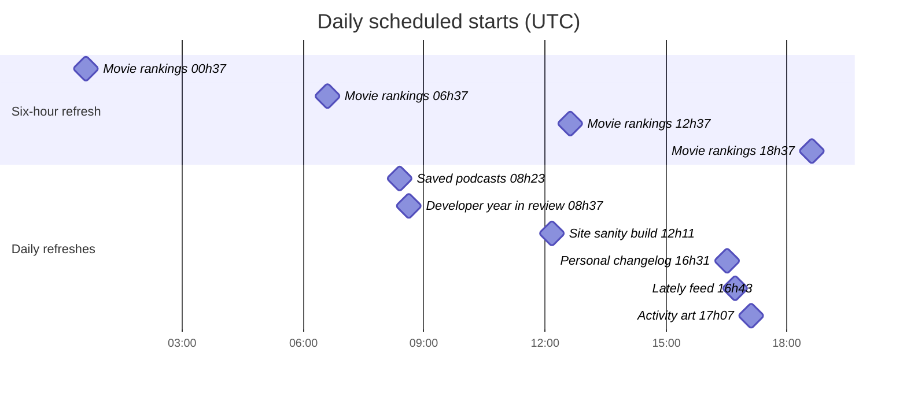
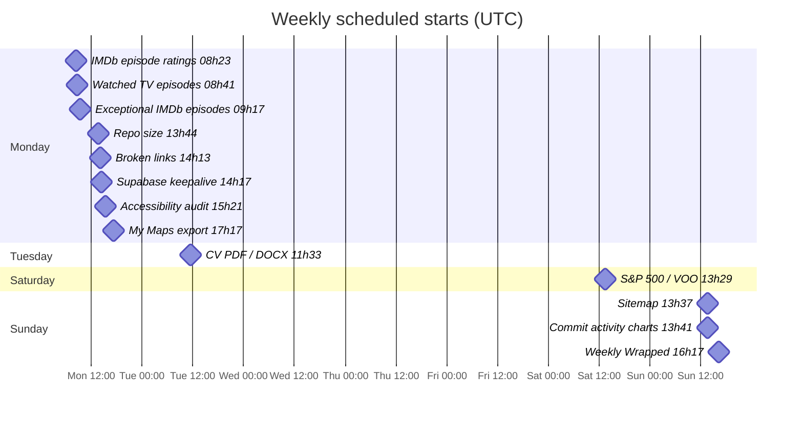
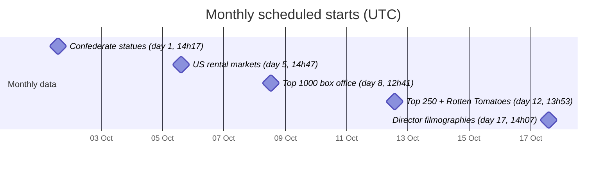

# GitHub Actions schedule

The automation clock for [Cavan's website](https://cavandonohoe.github.io): **27 scheduled workflows, 28 cron rules**, plus workflows triggered by pushes, PRs, issues, or other workflows.

Checked against `main` on **2026-10-08** ([source snapshot](https://github.com/cavandonohoe/cavandonohoe.github.io/commit/4960c97e0bd23e251a4ceda81640590f9f3f1a90)). The YAML files in [.github/workflows/](.github/workflows/) are the source of truth.

## Reading the clock

- **Charts use UTC**, matching the workflow cron expressions. Tables show both Pacific daylight time (PDT) and Pacific standard time (PST); choose the column for the date you are checking.
- Each diamond is a **scheduled start**, not a measured runtime. Chart dates are illustrative; the pattern repeats at the cadence shown.
- Scheduled runs can be delayed. Spaced start times do not guarantee that one workflow finishes before the next starts.
- Workflows with `workflow_dispatch` can also be run from the [Actions tab](https://github.com/cavandonohoe/cavandonohoe.github.io/actions).
- This is a documentation snapshot. Update it when a workflow's triggers change.

## Throughout the day

| Workflow | UTC schedule | Pacific schedule | Cron | Result |
|---|---|---|---|---|
| [TOHS reunion](.github/workflows/update_tohs_reunion.yml) | Every hour at :23 | Every hour at :23 | `23 * * * *` | Refresh coverage; deploy if published snapshot differs |
| [Personal movie rankings](.github/workflows/update_movie_ranker_personal.yml) | 00:37, 06:37, 12:37, 18:37 | PDT: 05:37, 11:37, 17:37, 23:37; PST: 04:37, 10:37, 16:37, 22:37 | `37 */6 * * *` | Refresh rankings; request site build when changed |

The daily chart includes all four movie-ranking runs. The hourly reunion check is omitted from the chart to keep it readable.

## Daily rhythm

| Workflow | When (UTC) | PDT (UTC−7) | PST (UTC−8) | Cron | Result |
|---|---|---|---|---|---|
| [Saved podcasts](.github/workflows/update_saved_episodes.yml) | Daily 08:23 | 01:23 | 00:23 | `23 8 * * *` | Refresh JSON and redeploy Shiny dashboard |
| [Developer year in review](.github/workflows/year-in-review.yml) | Daily 08:37 | 01:37 | 00:37 | `37 8 * * *` | Commit current-year stats (daily); previous-year snapshot (annual) |
| [Site sanity build](.github/workflows/pages-rmarkdown.yml) | Daily 12:11 | 05:11 | 04:11 | `11 12 * * *` | Render and validate; no deployment |
| [Personal changelog](.github/workflows/personal-changelog.yml) | Daily 16:31 | 09:31 | 08:31 | `31 16 * * *` | Commit changelog JSON |
| [Lately feed](.github/workflows/lately.yml) | Daily 16:43 | 09:43 | 08:43 | `43 16 * * *` | Commit recent-activity summary |
| [Activity art](.github/workflows/activity-art.yml) | Daily 17:07 | 10:07 | 09:07 | `7 17 * * *` | Commit activity SVG |

## Weekly rhythm

These runs are in addition to the hourly and daily work above. Monday has the largest cluster of scheduled checks and data refreshes.

| Workflow | When (UTC) | PDT (UTC−7) | PST (UTC−8) | Cron | Result |
|---|---|---|---|---|---|
| [IMDb episode ratings](.github/workflows/update_imdb_ratings.yml) | Mon 08:23 | 01:23 | 00:23 | `23 8 * * 1` | Refresh ratings; request site build when changed |
| [Watched TV episodes](.github/workflows/update_watched_episodes.yml) | Mon 08:41 | 01:41 | 00:41 | `41 8 * * 1` | Refresh episodes; request site build when changed |
| [Exceptional IMDb episodes](.github/workflows/update_imdb_exceptional_episodes.yml) | Mon 09:17 | 02:17 | 01:17 | `17 9 * * 1` | Validate official datasets; publish results and request site build |
| [Repo size](.github/workflows/repo-size.yml) | Mon 13:44 | 06:44 | 05:44 | `44 13 * * 1` | Upload report; may open threshold issue |
| [Broken links](.github/workflows/link-check.yml) | Mon 14:13 | 07:13 | 06:13 | `13 14 * * 1` | Upload report; open or update issue on broken links |
| [Supabase keepalive](.github/workflows/ping-movie-ranker-supabase.yml) | Mon 14:17 | 07:17 | 06:17 | `17 14 * * 1` | Read one row to keep database active |
| [Accessibility audit](.github/workflows/pa11y.yml) | Mon 15:21 | 08:21 | 07:21 | `21 15 * * 1` | Upload report; open or update issue on errors |
| [My Maps export](.github/workflows/update_mymaps_export.yml) | Mon 17:17 | 10:17 | 09:17 | `17 17 * * 1` | Refresh KML/CSV; request site build when changed |
| [CV PDF / DOCX](.github/workflows/rebuild_cv.yml) | Tue 11:33 | 04:33 | 03:33 | `33 11 * * 2` | Open PR for meaningful CV changes |
| [S&P 500 / VOO](.github/workflows/update_sp500.yml) | Sat 13:29 | 06:29 | 05:29 | `29 13 * * 6` | Refresh prices; request site build when changed |
| [Sitemap](.github/workflows/refresh-sitemap.yml) | Sun 13:37 | 06:37 | 05:37 | `37 13 * * 0` | Commit sitemap; request site build when changed |
| [Commit activity charts](.github/workflows/refresh-commit-activity.yml) | Sun 13:41 | 06:41 | 05:41 | `41 13 * * 0` | Re-knit README and charts; request site build when changed |
| [Weekly Wrapped](.github/workflows/weekly-wrapped.yml) | Sun 16:17 | 09:17 | 08:17 | `17 16 * * 0` | Commit weekly activity snapshot |

**Dependabot is separate:** [.github/dependabot.yml](.github/dependabot.yml) checks GitHub Actions dependencies on **Mondays at 10:00 America/Los_Angeles** (17:00 UTC during PDT; 18:00 UTC during PST), opening grouped update PRs as needed. Unlike the cron rules above, its local time follows daylight saving time.

## Monthly rhythm

| Workflow | When (UTC) | PDT (UTC−7) | PST (UTC−8) | Cron | Result |
|---|---|---|---|---|---|
| [Confederate statues](.github/workflows/update_confederate_statues_data.yml) | Day 1 at 14:17 | 07:17 | 06:17 | `17 14 1 * *` | Refresh CSV; request site build when changed |
| [US rental markets](.github/workflows/update_us_rentals.yml) | Day 5 at 14:47 | 07:47 | 06:47 | `47 14 5 * *` | Refresh Zillow data; request site build when changed |
| [Top 1000 box office](.github/workflows/update_top1000_box_office.yml) | Day 8 at 12:41 | 05:41 | 04:41 | `41 12 8 * *` | Refresh box office and caches; request site build when changed |
| [Top 250 + Rotten Tomatoes](.github/workflows/update_top250_with_rt.yml) | Day 12 at 13:53 | 06:53 | 05:53 | `53 13 12 * *` | Refresh ratings; request site build when changed |
| [Director filmographies](.github/workflows/update_director_filmographies.yml) | Day 17 at 14:07 | 07:07 | 06:07 | `7 14 17 * *` | Refresh TMDb data; request site build when changed |

## Annual checkpoints

| Workflow | When (UTC) | PDT (UTC−7) | PST (UTC−8) | Cron | Result |
|---|---|---|---|---|---|
| [Best Picture winners](.github/workflows/update_best_picture_winners.yml) | Mar 23 at 16:23 | 09:23 | 08:23 | `23 16 23 3 *` | Open PR if winners data changed |
| [Developer year in review](.github/workflows/year-in-review.yml) | Jan 1 at 17:13 | 10:13 | 09:13 | `13 17 1 1 *` | Commit current-year stats (daily); previous-year snapshot (annual) |

The daily Developer year in review run updates the current UTC calendar year. Its January 1 run snapshots the year that just ended. Manual runs also support a chosen year or a full historical backfill.

## Workflows without a clock

| Workflow | Trigger | Purpose |
|---|---|---|
| [Site deploy and previews](.github/workflows/pages-branch-previews.yml) | Push to `main`; PR activity and closure; manual | Publish production, create PR previews, and clean up closed previews |
| [Lighthouse](.github/workflows/lighthouse.yml) | PR activity; completed site-deploy workflow; manual | Audit PR previews and successful production build artifacts |
| [R lint](.github/workflows/lint.yml) | PR touching matching R/Rmd or lint configuration files; manual | Lint changed files |
| [Rmd smoke test](.github/workflows/pr-smoke.yml) | PR touching matching Rmd or site configuration files; manual | Render changed Rmd pages |
| [R tests](.github/workflows/test.yml) | Push/PR touching matching test, R script, or hook files; manual | Run hook smoke test and R tests |
| [Spell check](.github/workflows/typos.yml) | PR; manual | Check spelling |
| [PR labeler](.github/workflows/labeler.yml) | PR target activity | Apply labels based on changed paths |
| [Project case studies](.github/workflows/project-case-studies.yml) | Push to `main`; manual | Refresh project metadata |
| [Data question intake](.github/workflows/data-question.yml) | Issue opened | Acknowledge supported public-data questions |
| [Shared data refresh](.github/workflows/refresh-data.yml) | Called by another workflow | Shared refresh, validation, commit, and build-dispatch logic; no independent schedule |

Some scheduled workflows also have event triggers: the site sanity build and commit charts run on matching pushes; saved podcasts run on dashboard/workflow pushes; Lately runs when its workflow changes; broken-link and repo-size checks also run on PRs; reunion, exceptional episodes, and year-in-review have scoped PR validation triggers. See each linked YAML for path filters and job conditions.

## Refresh versus publish

The daily **site sanity build does not deploy**. Production publishing belongs to `pages-branch-previews.yml`.

A data commit and a published page are separate steps. Many refresh workflows explicitly dispatch the site build after changes because pushes made with `GITHUB_TOKEN` do not trigger ordinary downstream push workflows. Saved podcasts redeploy their Shiny app instead. CV and Best Picture winners open PRs for review.

Activity art, the personal changelog, Lately, Weekly Wrapped, and Developer year in review commit generated output without explicitly dispatching the site deployment. Their scheduled start should not be read as a guaranteed production-update time.
