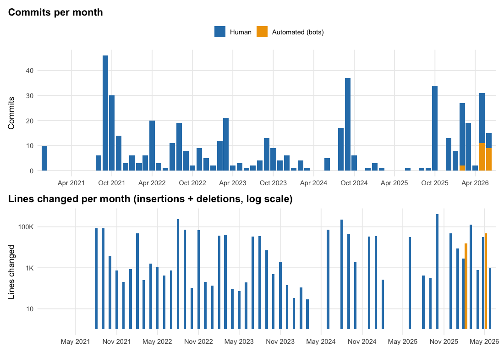
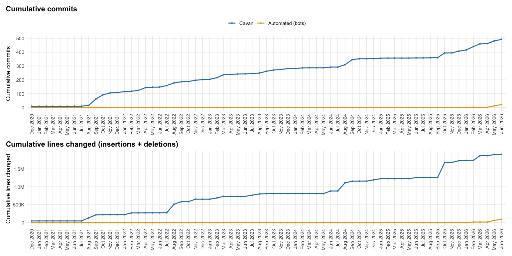

<!-- README.md is generated from README.Rmd. Please edit that file -->

# Cavan’s Website

<!-- badges: start -->

<!-- badges: end -->

The goal of my website is to display some fun side projects I have been
working on. Movie data intrigues me, so I scraped IMDb to use some of
their clean data. I also have my résumé here since it’s easier to share
a link than an attachment.

Check out my website at <https://cavandonohoe.github.io>

Highlights:

- Data projects and visualizations (IMDb, box office, ratings)
- Personal pages (blog, reunion, schedule)
- CV and learning resources

Movies & data:

- [IMDb TV
  Series](https://cavandonohoe.github.io/imdb_top_250_tv_series.html)
- [Best Picture vs Top 1000 Box
  Office](https://cavandonohoe.github.io/best_pic_vs_top_1000.html)
- [Top 250 Rated Movies with Rotten Tomato
  Scores](https://cavandonohoe.github.io/top_250_imdb_with_rt.html)
- [IMDb Series Rating
  Plots](https://cavandonohoe.github.io/imdb_rating_plot.html)
- [Best Picture
  Nominees](https://cavandonohoe.github.io/best_picture_nominees.html)
- [Director Box Office
  Trajectory](https://cavandonohoe.github.io/director_box_office_trajectory.html)
- [Rent vs. Buy
  Calculator](https://cavandonohoe.shinyapps.io/rent-vs-buy/)
  ([source](https://github.com/cavandonohoe/rent-vs-buy))
- [Confederate Statue
  Analysis](https://github.com/cavandonohoe/confederate_statues)
- [Sierpinski
  Triangle](https://cavandonohoe.github.io/sierpinski_triangle.html)
- [Airplane Boarding
  Simulation](https://cavandonohoe.github.io/airplane_boarding.html)

Personal:

- [Kelly
  Schedule](https://cavandonohoe.github.io/firefighter_schedule.html)
- [TOHS Class of 2012
  Reunion](https://cavandonohoe.github.io/tohs_reunion.html)
- [Blog](https://cavandonohoe.github.io/my_travels.html)

Learning:

- [Learn R (Course on Learning
  R)](https://cavandonohoe.github.io/learn_r.html)

CV:

- [CV](https://cavandonohoe.github.io/cv.html)

## Automation

The repo runs the following on a schedule via GitHub Actions. Anything
manual is a click away on the Actions tab.

### Site build & previews

- `pages-branch-previews.yml` – main deploy + per-PR preview deploy and
  cleanup. This is what publishes the site (pushes to the `gh-pages`
  branch).
- `pages-rmarkdown.yml` – daily safety-net build with DESCRIPTION /
  `library()` validation and gs4 guard checks. Does **not** deploy
  (deploy is owned by `pages-branch-previews.yml` to avoid Pages
  deployment races).

### Data refreshes (commits to `main`)

- `update_imdb_ratings.yml` – weekly IMDb episode ratings refresh.
- `update_top1000_box_office.yml` – monthly Best Picture + Top 1000 box
  office refresh.
- `update_top250_with_rt.yml` – monthly Top 250 + Rotten Tomatoes
  refresh.
- `update_director_filmographies.yml` – monthly TMDb director
  filmography refresh for the Director Box Office Trajectory page.
- `update_sp500.yml` – weekly VOO price refresh.
- `update_us_rentals.yml` – monthly Zillow ZHVI/ZORI refresh.
- `update_mymaps_export.yml` – weekly Google My Maps export.

### Data refreshes (open PR)

- `update_best_picture_winners.yml` – annual Oscar refresh.
- `rebuild_cv.yml` – weekly CV PDF/DOCX rebuild from Google Sheet, opens
  a PR if anything changed.
- `refresh-sitemap.yml` – weekly `sitemap.xml` regeneration.

### Site health

- `link-check.yml` – weekly + on-PR broken-link check (lychee).
- `pa11y.yml` – weekly accessibility audit (pa11y-ci).
- `lighthouse.yml` – two modes: on-PR audit of the deployed preview URL
  with a score comment, plus a post-build audit of the production
  artifact after each successful main build.
- `repo-size.yml` – weekly + on-PR repo-size report.

### Code quality

- `lint.yml` – on-PR lintr scan of changed R/Rmd files.
- `typos.yml` – on-PR spell check.
- `pr-smoke.yml` – on-PR fast render of only the changed Rmds.

### Repo hygiene

- `.github/dependabot.yml` – weekly bump of pinned GitHub Actions.
- `labeler.yml` – auto-label PRs by changed paths.

## Activity over time

The chart below summarizes commit activity on this repo: monthly commit
count and lines changed (insertions + deletions), split by my own
commits vs. automated commits from the scheduled data refresh workflows
above. Regenerated each time `README.Rmd` is knit.

*529 commits since Dec 2020 — 500 by me, 29 by scheduled bots — touching
2,051,012 lines in total.*

## Setup and Local Development

Local development, prerequisites, build steps, lint/test commands, and
PR conventions all live in [CONTRIBUTING.md](CONTRIBUTING.md).

### Project Structure

- `*.Rmd` files: Individual pages of the website
- `_site.yml`: Site configuration and navigation
- `_common.R`: Common R code (Google auth setup for CI)
- `header/header.html`: HTML header with meta tags and favicons
- `include_footer.html`: Footer with contact links
- `css/footer.css`: Footer styling
- `.github/workflows/`: GitHub Actions workflows for CI/CD
- `data/`: Data files used by various pages
- `scripts/`: Utility scripts (e.g., ensuring gs4 guards)

### Deployment

The site is automatically deployed to GitHub Pages via GitHub Actions
when changes are pushed to the `main` branch. See the Automation section
above for the full list of workflows.
