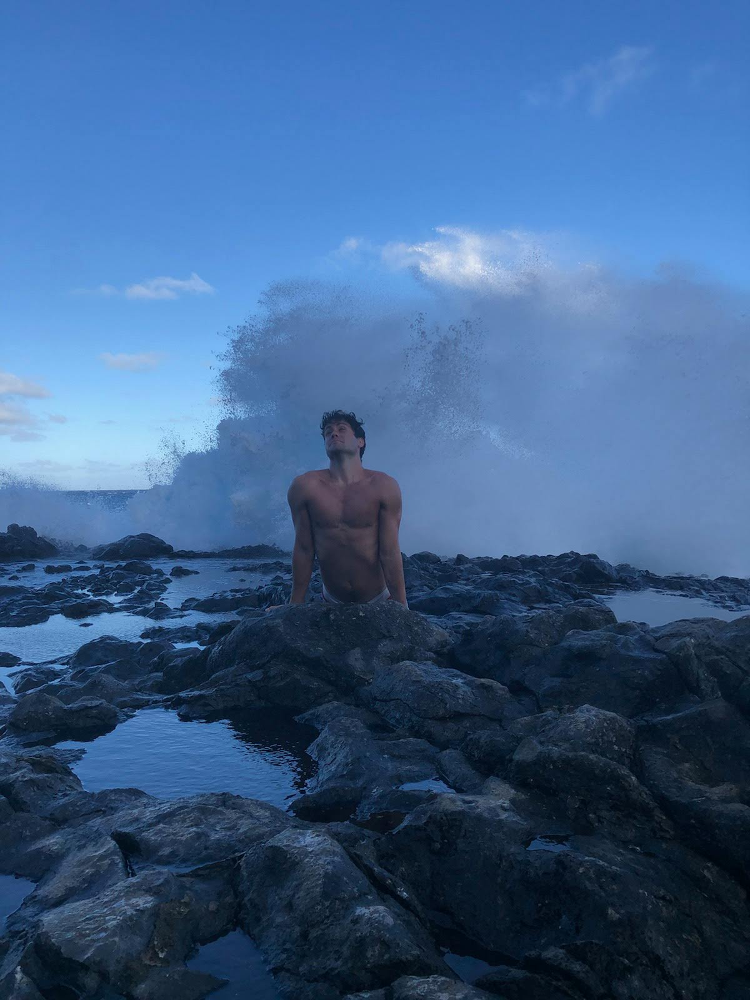

[Facebook](https://www.facebook.com/cavandonohoe)

[Instagram](https://www.instagram.com/cavandonohoe)

[LinkedIn](https://www.facebook.com/cavan-donohoe)

[GitHub](https://github.com/cavandonohoe)

*What do we live for, if not to make life less difficult for each other?*
- George Eliot

I know a resume/CV is supposed to show professional organizations what you know and how good you are at what you know. But it doesn't really get in the nitty gritty. It doesn't always show what you are truly passionate about. 

I am truly passionate on making life easier for people. If we don't have to waste time on the tedious, we can get to what we actually care about. If the passionate data analyst has to first collect the data in a rudimentary fashion, they will be drained by the time they actually get to the analysis. 

It is important for processes to be reproducible and scalable, even if they are ad hoc assignments. And as soon as those processes have been completed, they must be documented as detailed as possible so they can be reproducible by **anyone**. 

My father has been an actuary for more than 25 years and the biggest piece of advice he gave me was "if you are not available, make sure *anyone* can do your job. That doesn't mean your job is easy, it's because the documentation is so easy to comprehend."

I use that principle throughout my work life and make sure I explain everything in great detail to make sure everyone understands my analysis procedure. 

## Hobbies, Interests, and My Story

I have been playing beach volleyball for the past `r lubridate::year(Sys.Date()) - 2009` years. I knew my body would probably combust if I lived anywhere not close to a beach. So naturally out of university I moved to Oahu to work as an Actuarial Analyst.


Oahu was incredible. Every single weekend was a vacation. I got to go on hikes, go in the warm waters and look at fish, surf, and spend some quality time with good friends. I didn't have a car and I honestly didn't need one. Some days I did get a little carried away and just kept biking. Some days I just needed that escape and that warm wind in my face. 

I took a lot of pictures when I was in Hawaii, but this is my favorite:
  


Working as an actuary was my goal throughout university. And then when I finally became an actuary and started taking those exams while working, my fears came into reality. I didn't enjoy taking those exams. They were difficult and took a lot of work and a lot of time away from what I enjoyed doing in life. I am not one to shy away from a challenge, but I also enjoy my work life balance and would not sacrifice that over months with little benefit to my overall career growth.

So I quit being an actuary.

Now, I am back on the mainland after being offered a new job back home. I got on a plane and left that beautiful island and as soon I got back, the world seemed to be in flames. Suddenly everyone knew the word Coronavirus and became medical experts on Facebook. Still, I pursued my passions and hobbies as safely as I could. Volleyball had to have less high fives and licking the ball before jump serving. We all had to make some big adjustments. 

I noticed upon arriving back home, that my diet can start to change from 50% pineapple and 50% ahi tuna to something a little more diverse. I started enjoying the delicious LA eateries and all of their to-go containers. Inside dining was a hive for COVID-19 to fester in, so we ate these delicious meals in our cars. 

I've tried more than 50 new places to eat in 2020 with La Azteca leading the charge for burritos, Lao Xi'er Noodle House killing the game in Noodz, and Street Thai Cafe having the best Pad Thai and Thai Tea I have had and somehow staying under $10 for a meal. 

I'm pretty basic though. I like to eat, I like to play volleyball, and I like to bike. I can't wait to explore the world. I don't just want to travel, I want to live. I want to work with the Pyramids in the background, I want to eat a freshly made French baguette while coding, and I want to work while watching the waves crash in the distance of whatever island is next. Let's hope my current employer is okay with not seeing my face in person anytime soon. 

Now I am given the amazing experience working for GRAIL and am loving the projects I have been working on and the people I work with are the smartest people I have worked with to date. 

#### My Story 2022

I feel like this is half professional and half personal. I enjoy 'coding' these little blurbs even though there is not much coding needed to be done at this point. This year has had a lot of positives. Huge positive is that my remote work will be indefinite! That has been the big thing I have been chasing since I started working in Hawaii. I love having the options to live wherever and work from wherever. I will definitely be taking advantage of that. 

Now the thought is how to fully take advantage of the work from wherever lifestyle? How to bring up to my boss that Italy would be as productive of an environment as California? Or maybe the bigger question is when is the best time to actually get up and go? Sometimes life is just about executing decisions that may either backfire down the line or end up working heavily in your favor. I can't really tell yet based on any of my decisions so far, but it has lead me to a great job, a happy life, and a lot of opportunities to do what I want whenever I want. 

#### Small upated

I ended up working abroad! I worked from Spain, Italy, France, and Croatia! And I was actually responsibly productive about it. Cannot believe I did this in my 20s! Now what is next? Maybe an inspiring LinkedIn post... 


```{r echo=FALSE}
knitr::include_url("https://www.linkedin.com/embed/feed/update/urn:li:share:6956906897379590144", height = 570)

```


Inspiring right? Also, side note, I just learned how to embed a LinkedIn post in an Rmd. More difficult than you'd think, but as soon as you have done it once, you don't have to worry about relearning it. 

I don't think I will ever work in an office again. It's too much fun exploring the world with a laptop for months at a time.


 
