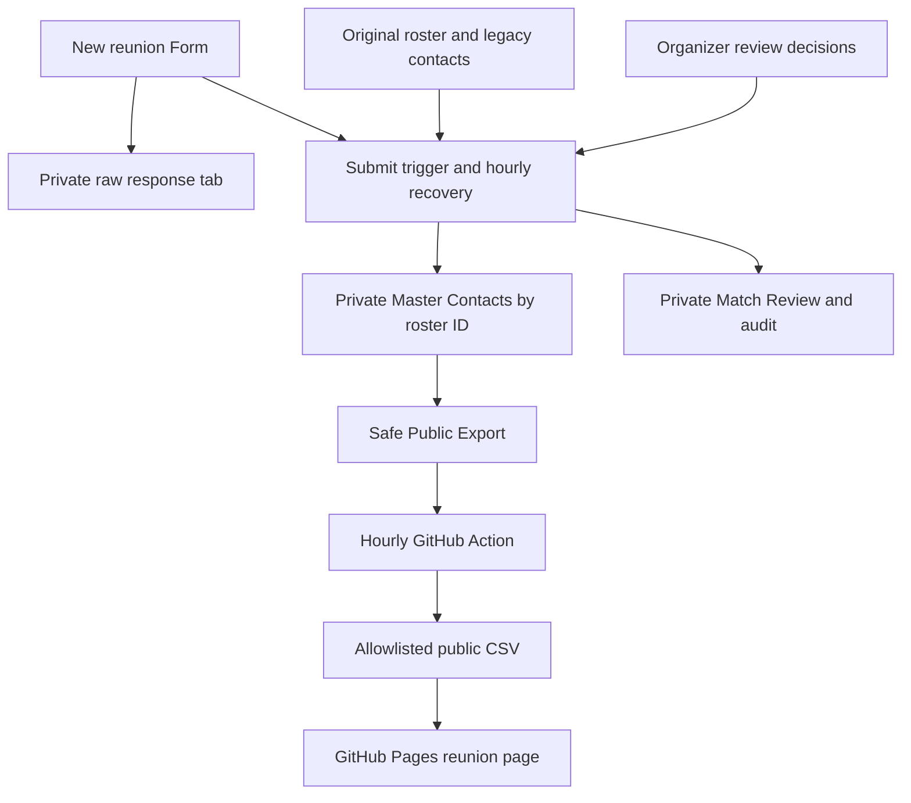

# TOHS reunion contact workflow

## Current rollout status

The new Form is installed and published, with a native response tab, submission
trigger and hourly recovery trigger. The private master is rebuilt successfully.
The production website remains on the old workflow until PR 206 is reviewed and
merged. No legacy data or old Form has been replaced or deleted.

[New contact Form](https://docs.google.com/forms/d/e/1FAIpQLSf6ooQrcPNEJI9DnVKlxtksYhhZtNEXHTzBNcalMiRgSRHHnw/viewform).
[Separate safe export workbook](https://docs.google.com/spreadsheets/d/1-LqsItnKUbSvGhMqMMKmHg-IkMk3uonioNJHD95st58/edit)
contains only the four public fields and is shared read-only with the existing
GitHub service account. It was created from sanitized data, with no contact data
in its version history. The private workbook is owner-only.

The original [TOHS Class of 2012 workbook](https://docs.google.com/spreadsheets/d/1JwWeBjwwQHzmGgh8HPuO_0pghzemC3ikpLx_pXlQvsI/edit)
remains authoritative for the graduation roster and manual legacy contact edits.
The [private staging workbook](https://docs.google.com/spreadsheets/d/14WancXKUFazrPQPz09vSQve0Ae9jroSAufHhbYNrJYw/edit)
contains a complete native copy of all three legacy tabs plus the V2 derived views.
Its sharing was verified as owner-only when created. Those copied legacy tabs are
a preservation snapshot; the script reads the original workbook each refresh.

At staging: 574 unique graduates, 218 nonblank master emails, 219 emails in the
derived view after conservative legacy reconciliation, and 60 legacy submissions
needing identity/field review. Original data is preserved regardless of a match.
These counts are a point-in-time check, not hardcoded workflow inputs.

## Data flow

The Form collects graduation first/last names, preferred/full name, email,
optional phone number, reunion interest, and planning-committee interest.
First name, last name, email, and the two interest answers are required. Interest
choices are Yes, No, Maybe. Respondent summaries and response editing are disabled.
The Form description explains which fields appear publicly.

Google stores native raw responses in a newly linked response tab in the staging
workbook. `refreshContactWorkflow()` also rereads Form responses by stable Google
response ID, so a failed submission trigger is recovered by the hourly trigger.
It never deletes or rewrites native responses, the original workbook, or its copied
legacy tabs. Only script-owned generated views are rebuilt.

## Matching and merge policy

* The roster ID from `Full Grad Class` is the permanent person key. Never use row
  position or a legacy response sequence ID as a person key.
* Automatically match only one exact graduation first/last name after case,
  Unicode and whitespace normalization. If the email points to another person,
  require identity review. No fuzzy name or email-only merges.
* Duplicate/unmatched names and changed surnames require an organizer to select
  an existing roster ID. New submissions never add people to the graduation roster.
* Fill empty fields. Keep nonempty existing fields. Blank answers never erase data.
  Differing nonempty values are retained in the raw source and queued for review.
  Other nonconflicting empty fields can still be filled from that same submission.
* Rebuild legacy submissions first, then new submissions in timestamp/response-ID
  order. The original roster is always the starting point. Repeated delivery of
  the same response is applied once. Full rebuilds are deterministic.
* `Master Contacts` holds accepted contacts, interests, and field-source response
  IDs. `Match Audit` records match outcomes. Original contacts remain in their
  original cells even after an explicitly approved V2 replacement.

For a review, copy the response ID from `Match Review` into `Review Decisions`,
enter the verified `roster_id`, choose `Approve fill`, `Approve replacement`, or
`Reject`, and enter a reviewer note identifying who verified it and why. Then run
`refreshContactWorkflow()` or wait for the hourly run. `Approve fill` resolves
identity and fills empties; it does not replace conflicting fields. `Approve
replacement` explicitly accepts nonblank replacement values from that response.
Keep source IDs unchanged and unique; changing legacy source IDs invalidates any
decisions attached to them. Never edit generated Master Contacts directly.

## Privacy boundary and reliability

`Public Export` and `data/tohs_reunion.csv` contain exactly:

| Field | Meaning |
| --- | --- |
| `first_name` | Graduation roster first name |
| `last_name` | Graduation roster last name |
| `email_bool` | Whether the merged private contact has an email |
| `updated_at` | Public snapshot timestamp |

No emails, phones, preferred names, response IDs, individual interest answers,
review decisions, or raw responses are written to GitHub, logs, or build artifacts.
Unit tests use reserved example.invalid addresses only. The public CSV begins with
the unchanged original roster's coverage; the synthetic Meghan test never changes
that committed snapshot or any live contact data.

The V2 Action reads only `Public Export`. It rejects unknown columns, malformed
coverage flags, unsafe names, inconsistent timestamps, export age over three hours,
and roster drops above 20%. Failed refreshes keep the last good public snapshot.
The website renderer only reads the checked-in snapshot and never bootstraps from
a private Sheet. A missing snapshot stops rendering.

The submit trigger refreshes the private views immediately. The hourly Google
trigger recovers missed events and applies reviews. GitHub checks at minute 23 of
each hour, updates only the allowlisted CSV/Form URL, and requests a Pages build
when the deployed data or Form URL differs. Google/GitHub scheduling and build
queues can delay this; it is not a real-time delivery guarantee.

Keep the entire contact workflow workbook private. GitHub has reader access only
to the separate export file, never the private response/master workbook. Google
permissions are file-wide; a safe tab inside a private workbook is insufficient.

## Installation and cutover

The installed Apps Script project is **TOHS 2012 Contact Workflow**. Its runtime
source corresponds to `scripts/tohs/contact_workflow.js`, with the test helper in
`scripts/tohs/acceptance_test.js`. Verify the three IDs before any reinstallation.
`installContactWorkflow()` reuses the stored Form ID and triggers on retry; it
publishes only after the linked destination and refresh succeed. Legacy rows with
no ID receive a stable SHA-256 content reference, never a roster person ID.

Merging PR 206 changes the website Form link and the Action source to the separate
safe export workbook. Those defaults are checked in; no repository variable is
required. Optional variables `TOHS_PUBLIC_SPREADSHEET_ID` and `TOHS_FORM_URL`
override them; never point the export variable at a private contact workbook.
CI validates the live service-account read on the PR without deploying production.
After merge, dispatch the reunion refresh on main and verify the Pages deployment.

The old Form, original roster, old contacts and historical responses remain
available. Roll back by reverting the PR and running the old refresh/deployment;
retain the new response workbook and Form data. Do not delete anything at cutover.

## Meghan Conlan acceptance test

Meghan is original roster ID 90, row 92 at inspection. Her original email is blank
and neither legacy contact tab contains a matching Conlan row. No real updated
email was found, so this PR does not invent or write one.

The local synthetic test verifies that a Meghan submission resolves to ID 90,
fills an empty email, increases coverage by one, disappears from the missing-email
list consumed by the website, leaves the input roster untouched, and exports no
email address. It also checks conflicts, duplicates, ambiguous identity, rejection,
replay, malformed values, and formula-like user input.

Live acceptance still requires the following observed evidence:

1. Submit a verified Meghan update to the new Form. Use her real supplied contact
   information, or use a disposable isolated test copy for a synthetic submission.
   Never submit a fake contact as a real production record.
2. Check native raw responses, Match Audit, roster ID 90 in Master Contacts, and
   `email_bool = TRUE` in Public Export. Confirm the original row was preserved.
3. Run the refresh Action on the PR branch and inspect its preview: collected
   count rises by one, Meghan leaves the missing list, and no private value appears
   in CSV, rendered HTML, artifacts, or logs.
4. After review/merge, dispatch refresh on main, check the deployment, and verify
   the production reunion URL. Until these steps are observed, do not label the
   workflow production-tested or claim Meghan's real update is live.

Local checks: `node --test tests/tohs-contact-workflow.test.cjs`; R checks:
`Rscript -e 'testthat::test_file("tests/testthat/test-tohs_reunion.R", stop_on_failure=TRUE)'`.
The R checks and rendered website preview run in GitHub CI if R is unavailable locally.

Google API references: [Forms](https://developers.google.com/apps-script/reference/forms/form)
and [Form triggers](https://developers.google.com/apps-script/reference/script/form-trigger-builder).
