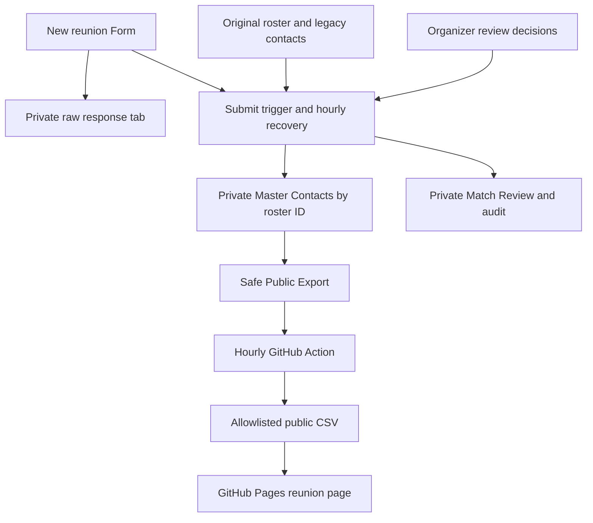

# TOHS reunion contact workflow

## Current rollout status

V2 is staged, not cut over. The original workbook, its three tabs, its Form link,
and the production website remain on the existing workflow. No legacy contact
data has been replaced or deleted. The new live Google Form and Apps Script
triggers still need installation and Google authorization. Do not enable the V2
repository variables until the acceptance checks below pass.

The original [TOHS Class of 2012 workbook](https://docs.google.com/spreadsheets/d/1JwWeBjwwQHzmGgh8HPuO_0pghzemC3ikpLx_pXlQvsI/edit)
remains authoritative for the graduation roster and manual legacy contact edits.
The [private staging workbook](https://docs.google.com/spreadsheets/d/14WancXKUFazrPQPz09vSQve0Ae9jroSAufHhbYNrJYw/edit)
contains a complete native copy of all three legacy tabs plus the V2 derived views.
Its sharing was verified as owner-only when created. Those copied legacy tabs are
a preservation snapshot; the script reads the original workbook each refresh.

At staging: 574 unique graduates, 218 nonblank master emails, 219 emails in the
derived view after conservative legacy reconciliation, and 60 legacy submissions
needing identity/field review. Original data is preserved regardless of a match.
These counts are a point-in-time check, not hardcoded workflow inputs.

## Data flow

The Form collects graduation first/last names, preferred/full name, email,
optional phone number, reunion interest, and planning-committee interest.
First name, last name, email, and the two interest answers are required. Interest
choices are Yes, No, Maybe. Respondent summaries and response editing are disabled.
The Form description explains which fields appear publicly.

Google stores native raw responses in a newly linked response tab in the staging
workbook. `refreshContactWorkflow()` also rereads Form responses by stable Google
response ID, so a failed submission trigger is recovered by the hourly trigger.
It never deletes or rewrites native responses, the original workbook, or its copied
legacy tabs. Only script-owned generated views are rebuilt.

## Matching and merge policy

* The roster ID from `Full Grad Class` is the permanent person key. Never use row
  position or a legacy response sequence ID as a person key.
* Automatically match only one exact graduation first/last name after case,
  Unicode and whitespace normalization. If the email points to another person,
  require identity review. No fuzzy name or email-only merges.
* Duplicate/unmatched names and changed surnames require an organizer to select
  an existing roster ID. New submissions never add people to the graduation roster.
* Fill empty fields. Keep nonempty existing fields. Blank answers never erase data.
  Differing nonempty values are retained in the raw source and queued for review.
  Other nonconflicting empty fields can still be filled from that same submission.
* Rebuild legacy submissions first, then new submissions in timestamp/response-ID
  order. The original roster is always the starting point. Repeated delivery of
  the same response is applied once. Full rebuilds are deterministic.
* `Master Contacts` holds accepted contacts, interests, and field-source response
  IDs. `Match Audit` records match outcomes. Original contacts remain in their
  original cells even after an explicitly approved V2 replacement.

For a review, copy the response ID from `Match Review` into `Review Decisions`,
enter the verified `roster_id`, choose `Approve fill`, `Approve replacement`, or
`Reject`, and enter a reviewer note identifying who verified it and why. Then run
`refreshContactWorkflow()` or wait for the hourly run. `Approve fill` resolves
identity and fills empties; it does not replace conflicting fields. `Approve
replacement` explicitly accepts nonblank replacement values from that response.
Keep source IDs unchanged and unique; changing legacy source IDs invalidates any
decisions attached to them. Never edit generated Master Contacts directly.

## Privacy boundary and reliability

`Public Export` and `data/tohs_reunion.csv` contain exactly:

| Field | Meaning |
| --- | --- |
| `first_name` | Graduation roster first name |
| `last_name` | Graduation roster last name |
| `email_bool` | Whether the merged private contact has an email |
| `updated_at` | Public snapshot timestamp |

No emails, phones, preferred names, response IDs, individual interest answers,
review decisions, or raw responses are written to GitHub, logs, or build artifacts.
Unit tests use reserved example.invalid addresses only. The public CSV begins with
the unchanged original roster's coverage; the synthetic Meghan test never changes
that committed snapshot or any live contact data.

The V2 Action reads only `Public Export`. It rejects unknown columns, malformed
coverage flags, unsafe names, inconsistent timestamps, export age over three hours,
and roster drops above 20%. Failed refreshes keep the last good public snapshot.
The website renderer only reads the checked-in snapshot and never bootstraps from
a private Sheet. A missing snapshot stops rendering.

The submit trigger refreshes the private views immediately. The hourly Google
trigger recovers missed events and applies reviews. GitHub checks at minute 23 of
each hour, updates only the allowlisted CSV/Form URL, and requests a Pages build
when the deployed data or Form URL differs. Google/GitHub scheduling and build
queues can delay this; it is not a real-time delivery guarantee.

Keep the entire workflow workbook private. Do not publish it to the web. Share
only with explicitly authorized organizers. GitHub's existing service account
needs viewer access to read the V2 export. Google permissions apply to the whole
workbook, so that account can technically read its private tabs; the code reads
only the safe tab. A separate sanitized export workbook is an optional later
hardening step, not a prerequisite for keeping private data out of GitHub.

## Installation and cutover

1. In a standalone Google Apps Script project, paste
   `scripts/tohs/contact_workflow.js`. It is source code only and contains no
   credentials or contact values. Verify both workbook IDs at the top.
2. Run `installContactWorkflow()` as the workbook owner and authorize Google Forms,
   Sheets, and trigger access. It creates one Form, links its response destination,
   installs submit/hourly triggers, builds the views, and then publishes the Form.
   Re-running reuses the stored Form ID and existing triggers. A partially created
   or manually changed question schema stops for inspection rather than creating
   another Form. Record the actual published URL from `Workflow Status`.
3. Verify the destination ID, response tab, private workbook sharing, Form settings,
   successful trigger execution and all preservation checks below. Do not remove
   the old Form or old contact tabs.
4. Give the existing GitHub service account viewer access to the workflow workbook.
   Obtain its identity from the existing key in GitHub settings; do not print the
   key, put it in source, or place it in build artifacts.
5. Set repository variable `TOHS_PUBLIC_SPREADSHEET_ID` to the verified workflow
   workbook ID and `TOHS_FORM_URL` to the observed published Form URL. The variables
   contain no contact values. Without the spreadsheet variable, the Action retains
   the existing read-and-sanitize source behavior for a safe staged rollout.
6. Validate the PR's live read and preview. Review and merge the PR separately;
   no direct main edits are part of this change. Dispatch the reunion refresh on
   main after merge, then verify the Pages build and public page.

The changes at cutover are the website's Form link and the Action's data source.
The old Form, original roster and historical responses are retained. To roll back,
clear the V2 spreadsheet variable and restore the old Form URL variable; rerun the
refresh and deployment. Retain the new response workbook even during rollback.

## Meghan Conlan acceptance test

Meghan is original roster ID 90, row 92 at inspection. Her original email is blank
and neither legacy contact tab contains a matching Conlan row. No real updated
email was found, so this PR does not invent or write one.

The local synthetic test verifies that a Meghan submission resolves to ID 90,
fills an empty email, increases coverage by one, disappears from the missing-email
list consumed by the website, leaves the input roster untouched, and exports no
email address. It also checks conflicts, duplicates, ambiguous identity, rejection,
replay, malformed values, and formula-like user input.

Live acceptance still requires the following observed evidence:

1. Submit a verified Meghan update to the new Form. Use her real supplied contact
   information, or use a disposable isolated test copy for a synthetic submission.
   Never submit a fake contact as a real production record.
2. Check native raw responses, Match Audit, roster ID 90 in Master Contacts, and
   `email_bool = TRUE` in Public Export. Confirm the original row was preserved.
3. Run the refresh Action on the PR branch and inspect its preview: collected
   count rises by one, Meghan leaves the missing list, and no private value appears
   in CSV, rendered HTML, artifacts, or logs.
4. After review/merge, dispatch refresh on main, check the deployment, and verify
   the production reunion URL. Until these steps are observed, do not label the
   workflow production-tested or claim Meghan's real update is live.

Local checks: `node --test tests/tohs-contact-workflow.test.cjs`; R checks:
`Rscript -e 'testthat::test_file("tests/testthat/test-tohs_reunion.R", stop_on_failure=TRUE)'`.
The R checks and rendered website preview run in GitHub CI if R is unavailable locally.

Google API references: [Forms](https://developers.google.com/apps-script/reference/forms/form)
and [Form triggers](https://developers.google.com/apps-script/reference/script/form-trigger-builder).
