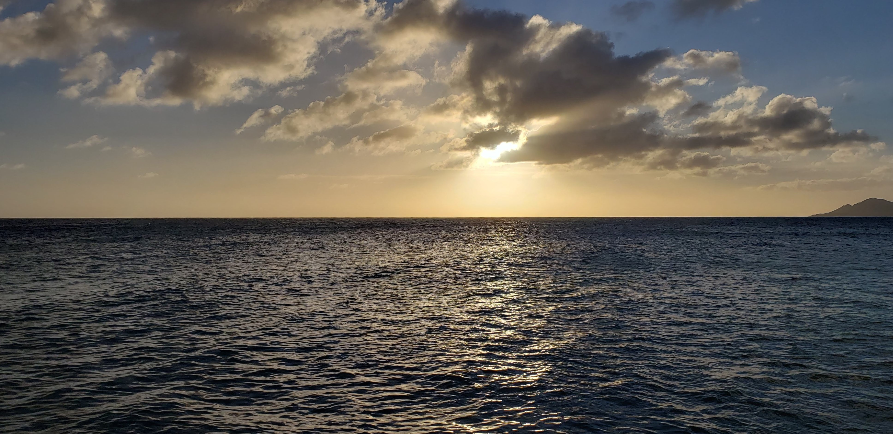

```{r setup-paths, include=FALSE}
# Use the project root for knitting; no library() calls needed
knitr::opts_knit$set(root.dir = here::here())
```


Welcome to my Website! I know it's not much, but it's all done in R and GitHub, so that's pretty cool.




I thought it might be worth investing some time to make a website to point to an area of my life where it gets a little more professional. But then I thought, why *just* do that? Why not incorporate some other aspects of my life that makes me me. So yes, this will have my ever growing resume, but let's have a little bit of fun while we're here.

