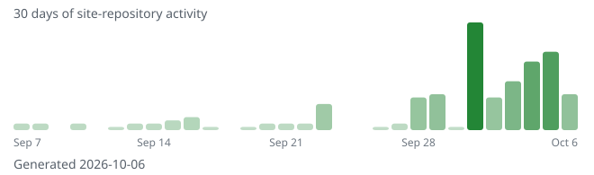

```{r structured-data, echo=FALSE, results='asis'}
cat('
<script type="application/ld+json">
{
  "@context": "https://schema.org",
  "@type": "Person",
  "name": "Cavan Donohoe",
  "jobTitle": "Data Scientist",
  "url": "https://cavandonohoe.github.io",
  "sameAs": [
    "https://github.com/cavandonohoe",
    "https://www.linkedin.com/in/cavan-donohoe/",
    "https://www.instagram.com/cavandonohoe",
    "https://www.facebook.com/cavandonohoe"
  ],
  "email": "cavandonohoe@gmail.com",
  "description": "Data Scientist passionate about making workflows easier through automation and reproducible analysis."
}
</script>
')
```

Welcome to my Website! It's all done in R and GitHub, so that's pretty cool. Most of the data
updates itself on a schedule too.


I thought it might be worth investing some time to make a website to point to an area of my life where it gets a little more professional. But then I thought, why *just* do that? Why not incorporate some other aspects of my life that makes me me. So yes, this will have my ever growing resume, but let's have a little bit of fun while we're here.

## Live Activity

```{r live-activity, echo=FALSE, results='asis'}
read_json_safe <- function(path) {
  if (!file.exists(path) || !requireNamespace("jsonlite", quietly = TRUE)) return(NULL)
  tryCatch(jsonlite::fromJSON(path, simplifyVector = FALSE), error = function(e) NULL)
}

lately <- read_json_safe("data/lately.json")
changelog <- read_json_safe("data/changelog.json")

commits <- if (!is.null(lately$commits)) lately$commits else "—"
areas <- if (!is.null(lately$active_areas)) length(lately$active_areas) else "—"
events <- if (!is.null(changelog$events)) length(changelog$events) else "—"
updated <- if (!is.null(lately$generated_at)) substr(lately$generated_at, 1, 10) else "waiting for first refresh"

panel <- paste0(
  '<div class="live-activity-panel">',
  '<div class="live-activity-topline"><span class="live-dot"></span> LIVE DATA <span class="live-updated">Updated ', updated, '</span></div>',
  '<div class="live-stat-grid">',
  '<div class="live-stat"><strong>', commits, '</strong><span>commits · 30 days</span></div>',
  '<div class="live-stat"><strong>', areas, '</strong><span>active areas</span></div>',
  '<div class="live-stat"><strong>', events, '</strong><span>recent events</span></div>',
  '</div>',
  '<div class="live-art-wrap"></div>',
  '<p class="live-explainer">This section is generated from the same GitHub Actions that build and refresh the site. The numbers and activity visualization update automatically.</p>',
  '</div>'
)
cat(panel)

if (!is.null(changelog$daily_summaries) && length(changelog$daily_summaries) > 0) {
  recent_days <- head(changelog$daily_summaries, 5)
  day_html <- vapply(recent_days, function(day) {
    date_label <- if (!is.null(day$date)) {
      d <- as.Date(day$date)
      toupper(format(d, "%b %d"))
    } else {
      ""
    }
    item_html <- vapply(day$items, function(item) {
      emoji <- if (!is.null(item$emoji)) item$emoji else "✨"
      text <- if (!is.null(item$text)) item$text else "Site updated"
      body <- paste0('<span class="activity-emoji">', emoji, '</span><span>', text, '</span>')
      if (!is.null(item$url) && nzchar(item$url)) {
        body <- paste0('<a href="', item$url, '">', body, '</a>')
      }
      paste0('<li>', body, '</li>')
    }, character(1))
    paste0(
      '<div class="activity-day">',
      '<div class="activity-date">', date_label, '</div>',
      '<ul>', paste(item_html, collapse = ""), '</ul>',
      '</div>'
    )
  }, character(1))
  cat(paste0(
    '<div class="recent-activity">',
    '<div class="recent-activity-heading"><h3>What I’ve been up to</h3>',
    '<span>Big-picture highlights from recent commits + merged PRs</span></div>',
    paste(day_html, collapse = ""),
    '</div>'
  ))
}
```

## Developer Year in Review

Commit totals and streaks reflect my personal commits in public repositories. Automated bot commits are excluded. Streaks use UTC calendar days.

```{r home-year-review, echo=FALSE, results='asis'}
files <- list.files("data/year-in-review", pattern = "^[0-9]{4}\\.json$", full.names = TRUE)
if (!length(files) || !requireNamespace("jsonlite", quietly = TRUE)) {
  cat('<div class="year-hero"><div class="year-kicker">Developer archive</div><div class="year-title">YEAR IN CODE</div><p>The first snapshot will appear here after the GitHub Action runs.</p></div>')
} else {
  years <- as.integer(sub("\\.json$", "", basename(files)))
  d <- jsonlite::fromJSON(files[which.max(years)])
  val <- function(x, fallback="—") if (is.null(x) || is.na(x) || identical(x, "")) fallback else x
  fmt <- function(x) if (is.numeric(x)) format(x, big.mark=",", scientific=FALSE, trim=TRUE) else val(x)
  cat(paste0(
    '<style>.year-hero{margin:1.5rem 0 2rem;padding:2.2rem;border-radius:18px;background:linear-gradient(135deg,#111827,#1f2937);color:#fff;box-shadow:0 14px 34px rgba(0,0,0,.18)}.year-kicker{text-transform:uppercase;letter-spacing:.16em;font-size:.8rem;opacity:.72}.year-title{font-size:clamp(2.3rem,7vw,5.6rem);line-height:.95;margin:.4rem 0 1.6rem;font-weight:800}.year-grid{display:grid;grid-template-columns:repeat(auto-fit,minmax(145px,1fr));gap:1rem}.year-stat{padding:1rem;border:1px solid rgba(255,255,255,.14);border-radius:12px;background:rgba(255,255,255,.06)}.year-stat strong{display:block;font-size:1.8rem}.year-stat span{opacity:.72;font-size:.9rem}.year-details{display:grid;grid-template-columns:repeat(auto-fit,minmax(220px,1fr));gap:.8rem;margin-top:1.2rem}.year-detail{padding:.9rem 1rem;border-radius:10px;background:rgba(255,255,255,.08)}.year-project{margin-top:1.2rem;padding:1rem 1.1rem;border-left:4px solid #60a5fa;background:rgba(96,165,250,.12);border-radius:0 10px 10px 0}.year-link{display:inline-block;margin-top:1rem;color:#bfdbfe!important;font-weight:600}</style>',
    '<div class="year-hero"><div class="year-kicker">Developer year in review</div>',
    '<div class="year-title">', d$year, ' IN CODE</div>',
    '<div class="year-grid">',
    '<div class="year-stat"><strong>', fmt(d$commits), '</strong><span>commits</span></div>',
    '<div class="year-stat"><strong>', fmt(d$pull_requests), '</strong><span>pull requests</span></div>',
    '<div class="year-stat"><strong>', fmt(d$repositories_touched), '</strong><span>repositories touched</span></div>',
    '<div class="year-stat"><strong>', fmt(d$lines_added), '</strong><span>lines added</span></div></div>',
    '<div class="year-details">',
    '<div class="year-detail"><strong>Top language by lines added:</strong> ', val(d$most_used_language), '</div>',
    '<div class="year-detail"><strong>Most-active month:</strong> ', val(d$most_active_month), '</div>',
    '<div class="year-detail"><strong>Longest streak:</strong> ', fmt(d$longest_streak_days), ' days</div></div>',
    '<div class="year-project"><strong>Biggest project</strong><br>', val(d$biggest_project),
    if (!is.null(d$biggest_project_commits)) paste0(' · ', fmt(d$biggest_project_commits), ' commits') else '', '</div>',
    '<a class="year-link" href="year_in_review.html">View the year-by-year archive →</a></div>'
  ))
}
```

## What I've Been Building

Here's my GitHub contribution activity, a live snapshot of the commits behind this site and my other projects.

```{r github-contributions, echo=FALSE, results='asis'}
cat('
<a href="https://github.com/cavandonohoe" class="gh-contrib-link"
   aria-label="Cavan Donohoe\'s GitHub contribution graph">
  
</a>
')
```

## Projects

```{r project-cards, echo=FALSE, results='asis'}
cards <- list(
  list("us_rental_markets.html", "\U0001F3D8\UFE0F", "US Rental Investment Markets", "Cap rates, vacancy, and demand signals for 3,800+ cities using Zillow and Census data."),
  list("la_real_estate.html", "\U0001F3E1", "LA Neighborhoods: Price per Sq Ft", "Zillow + Redfin data for LA neighborhoods: median prices, rent, and what $1M buys you."),
  list("la_housing_heatmap.html", "\U0001F5FA\UFE0F", "LA Housing Prices: Animated Heat Map", paste0("Zillow home values across LA County ZIP codes, animated year by year, with ", "Case-Shiller and Shiller's long-run series for context.")),
  list("https://cavandonohoe.shinyapps.io/rent-vs-buy/", "\U0001F9EE", "Rent vs. Buy Calculator", "Interactive Shiny app for side-by-side financial simulation of renting vs. buying."),
  list("https://cavandonohoe.shinyapps.io/podcast-dashboard/", "\U0001F3A7", "Saved Podcast Episodes", paste0("Interactive Shiny dashboard of my saved Spotify podcast episodes: ", "per-show breakdowns, listening hours, and a monthly saving timeline.")),
  list("imdb_exceptional_episodes.html", "\U2B50", "Exceptional IMDb Episodes", "Which popular shows have episodes rated 9.7+? Explore IMDb data, episode vote thresholds, and the Top 250 comparison."),
  list("imdb_top_250_tv_series.html", "\U0001F4FA", "IMDb Top 250 TV Series", "Scraped ratings, seasons, and trends for the top 250 TV shows on IMDb."),
  list("best_picture_nominees.html", "\U0001F3AC", "Best Picture Nominees", "Oscar Best Picture data: distributors, producers, and historical nominee analysis."),
  list("top_250_imdb_with_rt.html", "\U0001F37F", "Top 250 IMDb + Rotten Tomatoes", "Cross-referencing IMDb's top 250 movies with Rotten Tomatoes scores."),
  list("imdb_rating_plot.html", "\U0001F4C8", "IMDb Rating Plot", "Interactive episode-by-episode rating visualization for any TV series."),
  list("tv_decline_leaderboard.html", "\U0001F4C9", "Did They Quit While They Were Ahead?", paste0("Which shows ended on their best season and which limped out: every tracked ", "series ranked by how far it fell from its own peak.")),
  list("director_box_office_trajectory.html", "\U0001F3A5", "Director Box Office Trajectory", "Career arcs of major directors, film by film, measured in box office receipts."),
  list("avca_all_americans.html", "\U0001F3D0", "AVCA Volleyball All-Americans", "Web-scraped history of men's volleyball All-American selections and champions."),
  list("firefighter_schedule.html", "\U0001F692", "Firefighter Schedule", "Shift calendar generator for firefighter 48/96 schedules."),
  list("google_maps_saved_places.html", "\U0001F4CD", "Google Maps Saved Places", 'My "Want to Go" and "Favorites" lists exported and visualized.'),
  list("detour-finder/index.html", "\U0001F5FA\UFE0F", "Detour Finder", paste0("Draw a route and find which of my saved places sit within a corridor of it, ", "so a long drive can pick up a few stops.")),
  list("my_imdb.html", "\U2B50", "My IMDb Ratings", "Personal movie ratings and watchlist from my IMDb account."),
  list("my_travels.html", "\U2708\UFE0F", "Get Bloggy With It", "Travel blog entries from my adventures around the world."),
  list("tohs_reunion.html", "\U0001F393", "TOHS Class of 2012 Reunion", "Tracking down classmates for the reunion, and who we're still missing emails for."),
  list("best_pic_vs_top_1000.html", "\U0001F39E\UFE0F", "Best Picture vs Top 1000 Box Office", "Do Oscar winners also dominate the box office? An interactive comparison."),
  list("maze-art.html", "🧩", "Animated Procedural Maze", "Watch a maze emerge step by step, customize its geometry, and export your design."),
  list("sierpinski_triangle.html", "\U0001F53A", "Sierpinski Triangle", "Fractal geometry generated in R: the classic chaos game visualization."),
  list("airplane_boarding.html", "\U2708\UFE0F", "Airplane Boarding Simulation", "Animated head-to-head race of Steffen, WILMA, Back-to-Front, Reverse Pyramid, and Random."),
  list("confederate_statues.html", "\U0001F5FF", "Confederate Statues Timeline", "When were Confederate monuments erected? A data-driven look at the timeline."),
  list("sdtm_with_r.html", "\U0001F9EA", "SDTM with R", "Building CDISC SDTM clinical trial datasets in R, with worked examples."),
  list("learn_r.html", "\U0001F4DA", "Learn R", "Tutorial series: intro, data manipulation, visualization, and statistics in R.")
)
html <- '<div class="project-grid">'
for (card in cards) html <- paste0(html, sprintf('<a class="project-card" href="%s"><div class="card-icon">%s</div><h3>%s</h3><p>%s</p></a>', card[[1]], card[[2]], card[[3]], card[[4]]))
html <- paste0(html, "</div>")
cat(html)
```
