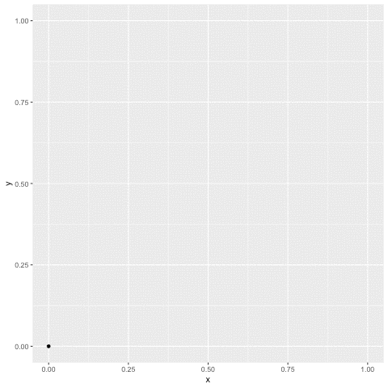

So I saw [this video](https://www.youtube.com/watch?v=Fgu5-3ihVVI) the other day while strolling through my feed. It was a video of the demonstration of the Sierpinski Triangle and how you can make it with a bunch of points. The idea is to draw 3 vertices of an equilateral triangle, and then choose a random point. Then take the midpoint between a random vertex and that point, then plot that point. Then for the new point take a random vertex and plot the midpoint again. Then keep doing that over and over again until something beautiful appears.

```{r setup, include=FALSE}
# Set default chunk output
knitr::opts_chunk$set(
  echo = FALSE, message = FALSE, warning = FALSE,
  results = "asis", fig.height = 4, fig.width = 4
)
```

```{r libraries}
library(tidyverse)
```


```{r include=FALSE}
set.seed(12)

triangle_list = list(x1 = c(0,0), x2 = c(.5, 1), x3 = c(1,0))

midpoint = function(x,y) {
  c((x[1] + y[1]) / 2, (x[2] + y[2]) / 2)
}

test_list = list()
starting_point = c(.5,.25)
for (i in 1:20000) {
  if (i == 1) {
    middle_point = starting_point
  } else {
    random_point = sample(triangle_list, 1) %>% unlist
    middle_point = midpoint(test_list[[i-1]], random_point)
  }
  test_list[[i]] = middle_point
}

starting_triangle = triangle_list %>% lapply(function(z) tibble(x = z[1], y = z[2])) %>% bind_rows()

zap_triangle = test_list %>% lapply(function(z) tibble(x = z[1], y = z[2])) %>% bind_rows() %>% bind_rows(starting_triangle, .)
```

The first 3 points

### n = 3

```{r}
zap_triangle %>%
  mutate(time = row_number()) %>%
  filter(time <= 3) %>%
  ggplot(aes(x, y)) + geom_point() +
  theme_void()
```

### n = 10

```{r}
zap_triangle %>%
  mutate(time = row_number()) %>%
  filter(time <= 10) %>%
  ggplot(aes(x, y)) + geom_point() +
  theme_void()
```

### n = 100

```{r}
zap_triangle %>%
  mutate(time = row_number()) %>%
  filter(time <= 100) %>%
  ggplot(aes(x, y)) + geom_point() +
  theme_void()
```

### n = 1000

```{r}
zap_triangle %>%
  mutate(time = row_number()) %>%
  filter(time <= 1000) %>%
  ggplot(aes(x, y)) + geom_point() +
  theme_void()
```

### n = 20000

```{r}
zap_triangle %>%
  mutate(time = row_number()) %>%
  filter(time <= 20000) %>%
  ggplot(aes(x, y)) + geom_point() +
  theme_void()
```

### Animation


